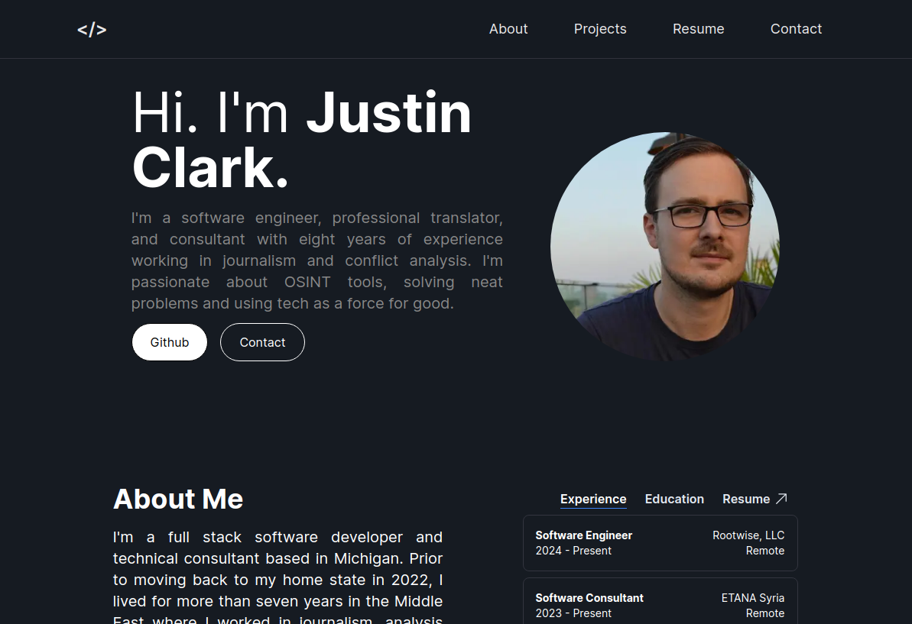

<a name="readme-top"></a>

[![Contributors][contributors-shield]][contributors-url]
[![Forks][forks-shield]][forks-url]
[![Stargazers][stars-shield]][stars-url]
[![Issues][issues-shield]][issues-url]
[![MIT License][license-shield]][license-url]
[![LinkedIn][linkedin-shield]][linkedin-url]

<!-- PROJECT LOGO -->
<br />
<div align="center">
  <a href="https://github.com/jclark1913/personal-website-v3">
    
  </a>

<h3 align="center">Portfolio Website</h3>
  <p align="center">
    A lightweight landing page in Next & Typescript
    <br />
    <a href="https://github.com/jclark1913/personal-website-v3"><strong>Explore the docs »</strong></a>
    <br />
    <br />
    <a href="https://justinclark.bio">View Demo</a>
  </p>
</div>

<!-- TABLE OF CONTENTS -->
<details>
  <summary>Table of Contents</summary>
  <ol>
    <li>
      <a href="#about-the-project">About The Project</a>
      <ul>
        <li><a href="#built-with">Built With</a></li>
      </ul>
    </li>
    <li>
      <a href="#getting-started">Getting Started</a>
      <ul>
        <li><a href="#installation">Installation</a></li>
      </ul>
    </li>
    <li><a href="#license">License</a></li>
    <li><a href="#contact">Contact</a></li>
    <li><a href="#acknowledgments">Acknowledgments</a></li>
  </ol>
</details>


<!-- ABOUT THE PROJECT -->
## About The Project

This is my personal website that I put together with Next, React, Typescript and Vercel.

<p align="right">(<a href="#readme-top">back to top</a>)</p>


### Built With

[![Next][Next.js]][Next-url]
[![React][React.js]][React-url]
[![TypeScript][TypeScript]][TypeScript-url]

<p align="right">(<a href="#readme-top">back to top</a>)</p>

### Installation

1. Clone the repo
   ```sh
   git clone https://github.com/jclark1913/personal-website-v3.git
   ```
3. Install NPM packages
   ```sh
   npm i
   ```
4. Run the development server
   ```sh
   npm run dev
   ```

<p align="right">(<a href="#readme-top">back to top</a>)</p>


<!-- LICENSE -->
## License

Distributed under the MIT License. See `LICENSE.txt` for more information.

<p align="right">(<a href="#readme-top">back to top</a>)</p>


<!-- CONTACT -->
## Contact

Justin Clark - [@twitter_handle](https://twitter.com/JustinClarkJO) - jclarksummit at gmail dot com

Project Link: [https://github.com/jclark1913/personal-website-v3](https://github.com/jclark1913/personal-website-v3)

<p align="right">(<a href="#readme-top">back to top</a>)</p>


<!-- ACKNOWLEDGMENTS -->
## Acknowledgments

I drew inspiration from a ton of different personal websites. Here's a few cool ones (in no particular order)

* [Sean Oliver](https://seanoliver.dev/)
* [Huse Kivrak](https://huse.dev/)
* [Judy Gab](https://github.com/judygab)

<p align="right">(<a href="#readme-top">back to top</a>)</p>


<!-- MARKDOWN LINKS & IMAGES -->
<!-- https://www.markdownguide.org/basic-syntax/#reference-style-links -->
[contributors-shield]: https://img.shields.io/github/contributors/jclark1913/personal-website-v3.svg?style=for-the-badge
[contributors-url]: https://github.com/jclark1913/personal-website-v3/graphs/contributors
[forks-shield]: https://img.shields.io/github/forks/jclark1913/personal-website-v3.svg?style=for-the-badge
[forks-url]: https://github.com/jclark1913/personal-website-v3/network/members
[stars-shield]: https://img.shields.io/github/stars/jclark1913/personal-website-v3.svg?style=for-the-badge
[stars-url]: https://github.com/jclark1913/personal-website-v3/stargazers
[issues-shield]: https://img.shields.io/github/issues/jclark1913/personal-website-v3.svg?style=for-the-badge
[issues-url]: https://github.com/jclark1913/personal-website-v3/issues
[license-shield]: https://img.shields.io/github/license/jclark1913/personal-website-v3.svg?style=for-the-badge
[license-url]: https://github.com/jclark1913/personal-website-v3/blob/master/LICENSE.txt
[linkedin-shield]: https://img.shields.io/badge/-LinkedIn-black.svg?style=for-the-badge&logo=linkedin&colorB=555
[linkedin-url]: https://linkedin.com/in/justin-w-clark
[product-screenshot]: images/portofolio.png
[Next.js]: https://img.shields.io/badge/next.js-000000?style=for-the-badge&logo=nextdotjs&logoColor=white
[Next-url]: https://nextjs.org/
[React.js]: https://img.shields.io/badge/React-20232A?style=for-the-badge&logo=react&logoColor=61DAFB
[React-url]: https://reactjs.org/
[TypeScript]: https://img.shields.io/badge/TypeScript-007ACC?style=for-the-badge&logo=typescript&logoColor=white
[TypeScript-url]: https://www.typescriptlang.org/
